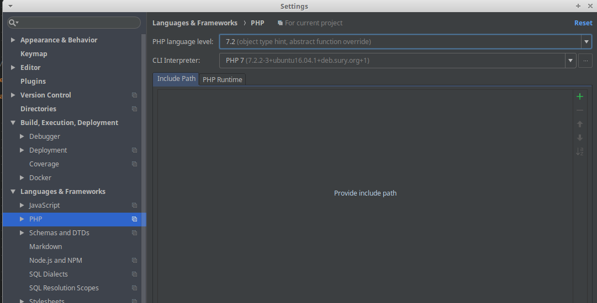

.. include:: ../../../Includes.txt

.. important::
   This chapter was written from scratch. Please review carefully.

current status: Very rough draft. Still needs more work!

==========================
Draft: Setting up Phpstorm
==========================

Conventions on this page:
* `menu items`

General setup
=============

* `File: Settings: Languages & Frameworks: PHP`
   * `PHP Language Level`
      * choose appropriate version
   * `CLI`
      * choose appropriate version

Coding Guidelines
=================

PHP files
---------

* `File: Settings: Editor: Code Style : PHP : Set From : Predefined Style`
   * chooose PSR-1 / PSR-2

Test this: Use `Code: Reformat Code` to reformat a PHP file

See also:

* `Coding guidelines for TYPO3 <https://docs.typo3.org/typo3cms/CoreApiReference/CodingGuidelines/Index.html>`__

Xliff files
-----------

Language files are usually stored in a Folder Resources/Private/Language in files with the ending .xlf.

While no tabs are allowed to indent in PHP files, you should edit xliff files using tabs.

.. Todo: How to set this up in Phpstorm, by default "Reformat code" converts .xlf files using spaces. Xliff is not
   listed in the standard Code Style file types

Recommended Plugins
====================

Install plugins using `File: Settings: Plugins`

* `DynamicReturnTypePlugin <https://plugins.jetbrains.com/plugin/7251-dynamicreturntypeplugin>`__
* `Php Inspections (EA Extended) <https://plugins.jetbrains.com/plugin/7622-php-inspections-ea-extended->`__
* `TYPO3 CMS Plugin <https://plugins.jetbrains.com/plugin/9496-typo3-cms-plugin>`__
* `TYPO3 XLIFF Utility <https://plugins.jetbrains.com/plugin/8098-typo3-xliff-utility>`__
* `TypoScript plugin <https://plugins.jetbrains.com/plugin/7463-typoscript-plugin>`__

Setup Phpstorm for writing tests for TYPO3
==========================================

* Settings: Languages & Frameworks: PHP: Test Frameworks (or "PHPUnit")
   * Use composer autoloader
   * Path to script: vendor/autoload.php
   * Test runner: Defaut configuration file: vendor/typo3/testing-framework/Resources/Core/Build/UnitTests.xml
   * Test Runner: Default bootstrap file: vendor/typo3/testing-framework/Resource/Core/Build/UnitTestsBootstrap.php

See:

* https://wiki.typo3.org/Development/PHPStorm_Settings