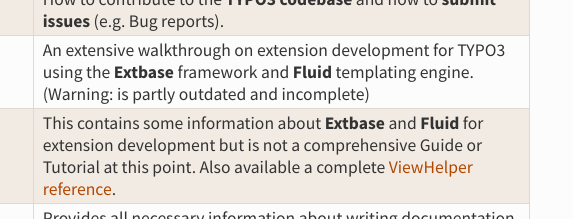

.. include:: ../../Includes.txt

.. _pain-points:

===========
Pain Points
===========

What are the main problems of TYPO3 documentation? What hurts the most?
Is it possible to prioritize them? This is difficult. Some tasks depend on
others, and some things are very important though they will not visibly
improve a thing (e.g. optimizing automation etc.).

For this reason, we try to categorize some of the main points. But we
cannot order them just yet.

My main point is, that we are currently not doing enough.
The number of people currently involved in the documentation are not
enough to ensure high quality and a good reading experience!

These things would already improve the documentation in an immediately
visible way:

#. Restrict width of reading area (see
   `issue <https://github.com/TYPO3-Documentation/t3SphinxThemeRtd/issues/83>`__)
#. Improve usability of version selector (issue:
   `Improve the version switcher - "unhide" it <https://github.com/TYPO3-Documentation/t3SphinxThemeRtd/issues/82>`__)
#. Improve theme to make it more readable (e.g. add padding around images, see
   `issue <https://github.com/TYPO3-Documentation/t3SphinxThemeRtd/issues/104>`__)
#. Change colors to adhere to Style Guide (see `issue
   <https://github.com/TYPO3-Documentation/t3SphinxThemeRtd/issues/110>`__)

These are long term things that should be done soon:

#. Decide about structure, including future of Extbase and Fluid book and guide
#. Decide about some open points, see section :ref:`decisions`
#. Seriously work on texts to make them up-to-date and without mistakes
#. Regularly gather feedback, see `Evaluate methods to get feedback (surveys, feedback button, ...)
   <https://github.com/TYPO3-Documentation/T3DocTeam/issues/65>`__

Points That Impede the Reading Experience
=========================================

Here we list things that make it difficult to read the documentation in
any way. Or that do not make it difficult, but make it less fun to read.
Or make it hard to find information etc.

Readability of Pages
--------------------

Readability of pages could be improved. There are a number of reasons that
impact this:

#. Width of reading area is not restricted. That makes the lines of the
   text usually be too wide on wide screens. It is recommended to use
   45 to 75 characters width. See `issue <https://github.com/TYPO3-Documentation/t3SphinxThemeRtd/issues/83>`__
#. Huge images. Very large images are often used. You have to scroll down
#. Images and text blend. The recommended `:class: with-shadow` which creates
   a drop shadow is often not used. There is not enough padding between images
   and text. Often the images contain text as well. It is difficult for the
   eye to make out what is text and what is image immediately. A good example
   where this is done better is Google developer, see `Kaycee Basques: "
   Get Started With Analyzing Runtime Performance" (Google Developers)
   <https://developers.google.com/web/tools/chrome-devtools/evaluate-performance/>`__.
   Here, not only is there a clear drop shadow, there is more padding around
   the image and it is indented.
   `See this TYPO3 page <https://docs.typo3.org/typo3cms/GettingStartedTutorial/8.7/GeneralPrinciples/BackendAndFrontend/Index.html>`__,
   though there are pages that are more problematic.

Related:

* See also :ref:`solutions-visually-structure-pages` in this manual for more
  examples.
* See `project on GitHub <https://github.com/orgs/TYPO3-Documentation/projects/4>`__

Text Outdated
-------------

Outdated text is a problem. Another problem is, if you don't know if the text is
up-to-date. This is especially a problem for new users.

Related:

* issue: `Add information when manual (or page) was last reviewed
  <https://github.com/TYPO3-Documentation/T3DocTeam/issues/73>`__
* issue: `Update the docs before we release the new version.
  <https://github.com/TYPO3-Documentation/T3DocTeam/issues/70>`__

Spelling Errors
---------------

While spelling errors do not prevent someone from reading directly, but they
probably do not give the impression of well maintained documentation. If you see
several spelling errors on a page, do you expect the information on that page
to be more correct, the same or less than without errors?

Unhelpful Information About Manuals
-----------------------------------

This is not helpful!

If this is outdated, where to go instead?

Source: `Tutorials and Guides <https://docs.typo3.org/typo3cms/GuidesAndTutorials/Index.html>`__
page on start page, a place people might look at **first**, when they are starting with TYPO3.

No Clear Reading Path for Target Groups
---------------------------------------

Integrators, developers.

For example, where to go as integrator? The information exists in various
places.

Search
------

Search is important in order to find things. This is already a known problem: Search
only searches in current manual. This is a task that might actually get done this year.

Related:

* `issue <https://github.com/TYPO3-Documentation/T3DocTeam/issues/43>`__

Usability of Version Selector
-----------------------------

See issue `Improve the version switcher - "unhide" it <https://github.com/TYPO3-Documentation/t3SphinxThemeRtd/issues/82>`__

Broken Links
------------

See several issues:

* `Avoid broken links on docs.typo3.org  <https://github.com/TYPO3-Documentation/T3DocTeam/issues/37>`__

Duplicate Information in Various Places
---------------------------------------

Various manuals, typo3.org, forge, the Wiki. This makes it confusing. Especially, if part
of the information is outdated and some is not.

Points that Make it Difficult or Not Motivating Enough for Contribution
=======================================================================

Unclarity About Tasks Forces
----------------------------

There are task forces. Are there?

No Open Sprints
---------------

No sprints where anyone can join.

Not Enough Best Practices or Examples
-------------------------------------

... that actually look good.

The example extension documentation is too
much to get started. None of the start pages look good.

Not Easy to Create Good Documentation
-------------------------------------

... that looks good and is well readable.

Because of issues with readability mentioned above. This is not motivating.

Toolchain
---------

* reST & Sphinx is still not easy to use and does pose a barrier.
  However, markdown is not a real alternative.
* people still have problems with Docker.

Can we improve the tools and toolchain in any way? Or the documentation for
contributors. What else can we do?

More ...
========

This is not a complete list.

See also open issues:

* `All issues <https://github.com/issues?utf8=%E2%9C%93&q=is%3Aopen+is%3Aissue+archived%3Afalse+org%3ATYPO3-Documentation++>`__
* `All issues in Team repo <https://github.com/issues?utf8=%E2%9C%93&q=is%3Aopen+is%3Aissue+archived%3Afalse+repo%3ATYPO3-Documentation%2FT3DocTeam>`__
* `All issues in Theme repo <https://github.com/TYPO3-Documentation/t3SphinxThemeRtd/issues>`__
